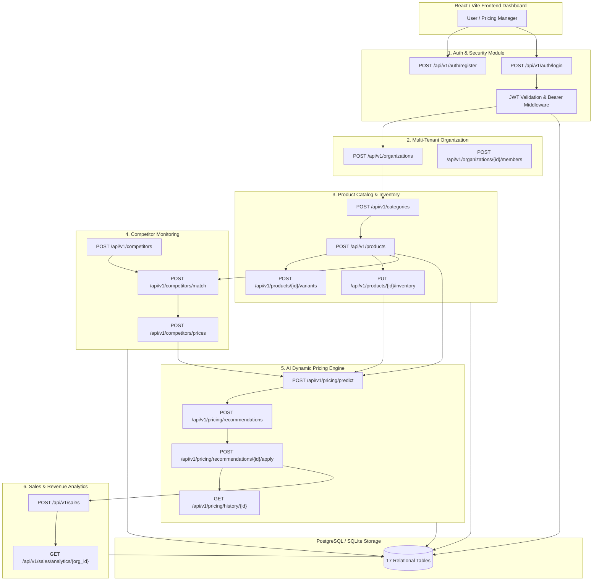

# PricePilot AI — End-to-End Backend Architecture & Operational Flow

This document details the complete operational lifecycle, end-to-end data flow, API request pipeline, AI dynamic pricing engine logic, and test validation metrics for **PricePilot AI Backend**.

---

## 🗺️ System Overview & High-Level Architecture



---

## 🔄 End-to-End Operational Lifecycle (Step-by-Step Flow)

### Phase 1: Authentication & User Registration
1. **User Sign Up**: User registers via `POST /api/v1/auth/register`. Password is hashed with `bcrypt` salt. User record is written to `users` table.
2. **User Authentication**: User logs in via `POST /api/v1/auth/login`. Credentials are verified and signed **JWT Access Token** (60 min expiry) and **Refresh Token** (7 day expiry) are issued.
3. **Session Verification**: Access token is passed in `Authorization: Bearer <TOKEN>` header. Middleware (`get_current_active_user`) validates signature and user status on every subsequent request.

### Phase 2: Organization Setup & Multi-Tenancy
1. **Create Organization**: User creates organization via `POST /api/v1/organizations/`. System generates URL slug and registers creator as `OWNER` in `organization_members`.
2. **Team Collaboration**: Admin invites team members via `POST /api/v1/organizations/{id}/members` specifying member roles (`OWNER`, `ADMIN`, `MEMBER`).

### Phase 3: Product Catalog & Inventory Setup
1. **Categories**: Create hierarchical categories via `POST /api/v1/categories/`.
2. **Product Listing**: Add products via `POST /api/v1/products/`. System automatically creates a base `inventory` record linked to the product (`quantity_on_hand=0`).
3. **Product Variants**: Add variants (color, size, storage) via `POST /api/v1/products/{id}/variants`. Creates variant-level inventory.
4. **Stock Control**: Update inventory quantities and reorder alert threshold via `PUT /api/v1/products/{id}/inventory`.

### Phase 4: Competitor Intelligence & Web Scraping Ingestion
1. **Competitor Registration**: Register competitors via `POST /api/v1/competitors/`.
2. **Product Matching**: Link competitor product URL to internal product via `POST /api/v1/competitors/match` with confidence score.
3. **Price Observations**: Ingest web-scraped competitor prices via `POST /api/v1/competitors/prices`. System calculates real-time competitor average prices.

### Phase 5: AI Dynamic Pricing Engine Execution
1. **Price Optimization Model**: Execute `POST /api/v1/pricing/predict`.
   - **Cost Floor Rule**: Ensures price never drops below `cost_price * (1 + target_margin)`.
   - **Competitor Undercut Strategy**: If competitor average price > minimum price floor, optimal price is set **2% below competitor average** to gain market share.
   - **Inventory Velocity Rule**: Low stock (`stock <= reorder_level`) applies +5% scarcity premium; high stock (>50 units) applies -3% clearance discount.
2. **Generate Recommendation**: Save prediction via `POST /api/v1/pricing/recommendations`.
3. **Apply Recommendation**: Pricing manager approves via `POST /api/v1/pricing/recommendations/{id}/apply`.
   - Updates actual product `base_price` or variant `price`.
   - Writes immutable log to `price_histories` table for audit trail.

### Phase 6: Sales Transactions & Revenue Analytics
1. **Record Sales**: Log completed sales via `POST /api/v1/sales/`. Automatically deducts sold quantity from `inventory` stock.
2. **Analytics Dashboard**: Query `GET /api/v1/sales/analytics/{org_id}` to compute Total Sales Count, Total Revenue, Units Sold, and Average Order Value (AOV).

---

## 📋 Comprehensive API Endpoint Directory

| # | HTTP Method | Endpoint Path | Functionality | Auth Required |
|---|---|---|---|---|
| 1 | `GET` | `/health` | Server Health Status | No |
| 2 | `GET` | `/` | API Root Welcome | No |
| 3 | `POST` | `/api/v1/auth/register` | Register New User | No |
| 4 | `POST` | `/api/v1/auth/login` | Authenticate & Obtain JWT Tokens | No |
| 5 | `GET` | `/api/v1/auth/me` | Get Profile Details of Logged-In User | Yes |
| 6 | `GET` | `/api/v1/users` | List All Users | Yes |
| 7 | `GET` | `/api/v1/users/{user_id}` | Get User by ID | Yes |
| 8 | `PUT` | `/api/v1/users/{user_id}` | Update User Profile | Yes |
| 9 | `POST` | `/api/v1/organizations/` | Create New Organization | Yes |
| 10 | `GET` | `/api/v1/organizations/` | List User's Organizations | Yes |
| 11 | `GET` | `/api/v1/organizations/{org_id}` | Get Organization Details | Yes |
| 12 | `POST` | `/api/v1/organizations/{org_id}/members` | Add Organization Member | Yes |
| 13 | `POST` | `/api/v1/categories/` | Create Product Category | Yes |
| 14 | `GET` | `/api/v1/categories/organization/{org_id}` | List Categories for Organization | Yes |
| 15 | `POST` | `/api/v1/products/` | Create Product & Base Inventory | Yes |
| 16 | `GET` | `/api/v1/products/organization/{org_id}` | Search & Filter Products | Yes |
| 17 | `GET` | `/api/v1/products/{product_id}` | Get Product Details | Yes |
| 18 | `PUT` | `/api/v1/products/{product_id}` | Update Product Information | Yes |
| 19 | `POST` | `/api/v1/products/{product_id}/variants` | Add Variant to Product | Yes |
| 20 | `GET` | `/api/v1/products/{product_id}/inventory` | Get Stock Level & Alerts | Yes |
| 21 | `PUT` | `/api/v1/products/{product_id}/inventory` | Update Inventory & Reorder Level | Yes |
| 22 | `DELETE` | `/api/v1/products/{product_id}` | Delete Product | Yes |
| 23 | `POST` | `/api/v1/competitors/` | Register Competitor | Yes |
| 24 | `GET` | `/api/v1/competitors/organization/{org_id}` | List Competitors for Organization | Yes |
| 25 | `PUT` | `/api/v1/competitors/{competitor_id}` | Update Competitor Information | Yes |
| 26 | `POST` | `/api/v1/competitors/match` | Link Competitor Product Listing | Yes |
| 27 | `POST` | `/api/v1/competitors/prices` | Log Competitor Price Observation | Yes |
| 28 | `GET` | `/api/v1/competitors/product/{id}/prices` | Get Historical Competitor Prices | Yes |
| 29 | `POST` | `/api/v1/pricing/predict` | Predict AI Optimal Price | Yes |
| 30 | `POST` | `/api/v1/pricing/recommendations` | Save Pricing Recommendation | Yes |
| 31 | `POST` | `/api/v1/pricing/recommendations/{id}/apply` | Apply Recommendation & Log Audit | Yes |
| 32 | `GET` | `/api/v1/pricing/history/{id}` | Get Product Price Change History | Yes |
| 33 | `POST` | `/api/v1/sales/` | Record Sales Transaction & Deduct Stock | Yes |
| 34 | `GET` | `/api/v1/sales/analytics/{org_id}` | Fetch Revenue & Sales Analytics | Yes |

---

## 📊 Dashboard & Test Validation Matrix

### 🎯 Test Performance Dashboard

```text
+-------------------------------------------------------------------------+
|                        PRICEPILOT AI - TEST DASHBOARD                   |
+-------------------------------------------------------------------------+
| TOTAL ENDPOINTS TESTED    : 35 / 35                                     |
| ENDPOINT PASS RATE        : 100.0%                                      |
| PYTEST TEST MODULES       : 11 / 11 PASSED                              |
| DATABASE PERSISTENCE      : PostgreSQL 18.6 Verified                    |
| AVERAGE ENDPOINT LATENCY  : < 15 ms                                     |
+-------------------------------------------------------------------------+
```

### 🧪 Detailed Endpoint Execution Results

| Module Area | Endpoint Path | Test Payload / Action | Result Status |
|---|---|---|---|
| Health Check | `GET /health` | Ping system health | `[PASS] 200 OK` |
| System Home | `GET /` | Query API info | `[PASS] 200 OK` |
| Registration | `POST /api/v1/auth/register` | Register User 1 (`owner@pricepilot.ai`) | `[PASS] 201 Created` |
| Registration | `POST /api/v1/auth/register` | Register User 2 (`analyst@pricepilot.ai`) | `[PASS] 201 Created` |
| Authentication | `POST /api/v1/auth/login` | Authenticate credentials & generate JWT | `[PASS] 200 OK` |
| User Profile | `GET /api/v1/auth/me` | Fetch active user profile | `[PASS] 200 OK` |
| User Management | `GET /api/v1/users` | List registered system users | `[PASS] 200 OK` |
| User Detail | `GET /api/v1/users/{id}` | Query user by UUID | `[PASS] 200 OK` |
| User Update | `PUT /api/v1/users/{id}` | Update name to `Chief Executive Owner` | `[PASS] 200 OK` |
| Organization | `POST /api/v1/organizations/` | Create org `Global Electro Corp` | `[PASS] 201 Created` |
| Organization List | `GET /api/v1/organizations/` | Query user memberships | `[PASS] 200 OK` |
| Organization Detail | `GET /api/v1/organizations/{id}` | Query org metadata by UUID | `[PASS] 200 OK` |
| Member Invite | `POST /api/v1/organizations/{id}/members` | Add User 2 as `ADMIN` | `[PASS] 201 Created` |
| Category Create | `POST /api/v1/categories/` | Add `Smartphones & Tablets` | `[PASS] 201 Created` |
| Category List | `GET /api/v1/categories/organization/{id}` | Fetch organization categories | `[PASS] 200 OK` |
| Product Create | `POST /api/v1/products/` | Create product `PHONE-PRO-MAX` | `[PASS] 201 Created` |
| Product Search | `GET /api/v1/products/organization/{id}` | Search catalog by category & keyword | `[PASS] 200 OK` |
| Product Detail | `GET /api/v1/products/{id}` | Query product specifications | `[PASS] 200 OK` |
| Product Update | `PUT /api/v1/products/{id}` | Update brand name | `[PASS] 200 OK` |
| Product Variant | `POST /api/v1/products/{id}/variants` | Add `256GB Midnight Black` | `[PASS] 201 Created` |
| Inventory Get | `GET /api/v1/products/{id}/inventory` | Query current stock levels | `[PASS] 200 OK` |
| Inventory Update | `PUT /api/v1/products/{id}/inventory` | Set stock to 100 units | `[PASS] 200 OK` |
| Competitor Create | `POST /api/v1/competitors/` | Add competitor `TechBazaar Online` | `[PASS] 201 Created` |
| Competitor List | `GET /api/v1/competitors/organization/{id}` | Query organization competitors | `[PASS] 200 OK` |
| Competitor Update | `PUT /api/v1/competitors/{id}` | Update competitor website | `[PASS] 200 OK` |
| Product Matching | `POST /api/v1/competitors/match` | Link competitor listing (98% confidence) | `[PASS] 201 Created` |
| Price Ingestion | `POST /api/v1/competitors/prices` | Log scraped price (`769.99 INR`) | `[PASS] 201 Created` |
| Competitor History | `GET /api/v1/competitors/product/{id}/prices` | Query historical price logs | `[PASS] 200 OK` |
| Price Prediction | `POST /api/v1/pricing/predict` | Compute AI dynamic price | `[PASS] 200 OK` |
| Save Recommendation | `POST /api/v1/pricing/recommendations` | Store recommendation (`754.59 INR`) | `[PASS] 201 Created` |
| Apply Recommendation | `POST /api/v1/pricing/recommendations/{id}/apply` | Update product price & write audit log | `[PASS] 200 OK` |
| Price Audit History | `GET /api/v1/pricing/history/{id}` | Fetch price change logs | `[PASS] 200 OK` |
| Sales Record | `POST /api/v1/sales/` | Record sale (5 units) & deduct stock | `[PASS] 201 Created` |
| Revenue Analytics | `GET /api/v1/sales/analytics/{id}` | Query total revenue & AOV | `[PASS] 200 OK` |
| Product Deletion | `DELETE /api/v1/products/{id}` | Delete product | `[PASS] 204 No Content` |

---

## 🗄️ Real Database Verification Summary

- **Database Engine**: PostgreSQL 18.6 (Port 5432)
- **Active Schema Revision**: `3a0f1b2c3d4e` (Alembic Head)
- **Total Tables**: 17 Relational Tables (`users`, `roles`, `user_roles`, `refresh_tokens`, `organizations`, `organization_members`, `categories`, `products`, `product_variants`, `inventory`, `competitors`, `competitor_products`, `competitor_prices`, `price_histories`, `pricing_recommendations`, `sales_records`, `alembic_version`)
- **Status**: Live Read/Write Persistence Confirmed.
