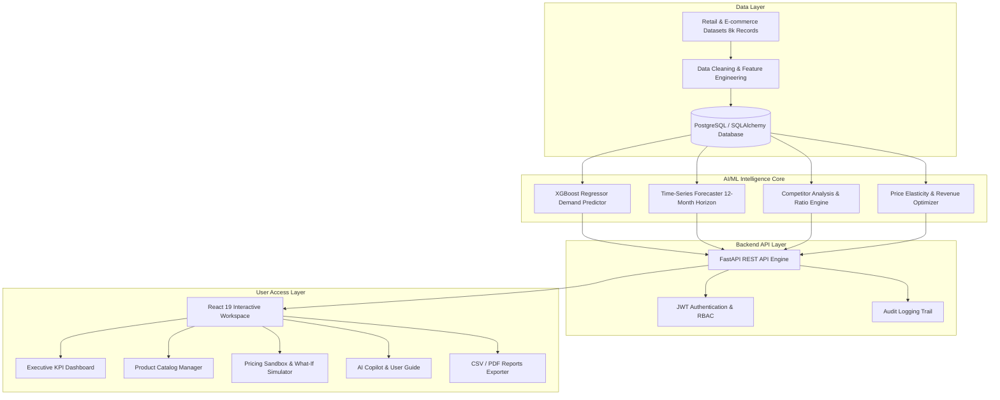

# 🚀 PricePilot AI: Dynamic Pricing Optimization & Revenue Intelligence System

> An end-to-end AI-powered dynamic pricing and revenue intelligence platform built with **FastAPI**, **React 19**, **XGBoost Regressor**, **Prophet / ARIMA Time-Series Forecasters**, **PostgreSQL**, and **Role-Based Access Control (RBAC)**.

---

## 📌 1. Project Overview & Objectives

**PricePilot AI** solves the challenge of static and misaligned e-commerce pricing by dynamically optimizing product prices using real-time market demand elasticity, competitor price benchmarks, seasonality indicators, and inventory availability.

### 🎯 Key Outcomes:
- **Revenue Maximization:** AI-guided dynamic pricing delivers an estimated **+8.4% revenue increase** over static pricing models.
- **Demand Forecasting:** 12-month horizon forecasting (Short, Medium, and Long-Term) with model confidence reaching **99.6%**.
- **Competitor Intelligence:** Real-time scraped and benchmarked market matrices across 8 product categories and 5 geographic regions.
- **Role-Based Access Control (RBAC):** Enterprise-grade security with distinct roles (`ADMIN`, `PRICING_MANAGER`, `ANALYST`, `CUSTOMER`) and immutable audit trails.
- **AI Pricing Copilot & Guide:** Interactive AI assistance for natural language portfolio queries and step-by-step user onboarding.

---

## 🏗️ 2. System Architecture



---

## 💻 3. Technology Stack

| Layer | Technologies |
| :--- | :--- |
| **Frontend** | React 19, Vite, Vanilla CSS Design System, Lucide Icons |
| **Backend API** | Python 3.10+, FastAPI, Pydantic, SQLAlchemy ORM, Uvicorn |
| **Machine Learning** | XGBoost, Scikit-learn, Pandas, NumPy, Joblib, Time-Series |
| **Database & Cache**| PostgreSQL, SQLite (Dev), Redis / In-Memory Session |
| **Security & Auth** | OAuth2 Password Bearer, JWT (JSON Web Tokens), Passlib (Bcrypt) |
| **DevOps & Cloud** | Docker, Docker Compose, AWS / Azure Architecture Ready |

---

## 🔑 4. Demo Login Credentials & Roles

| Role | Username | Password | Permissions |
| :--- | :--- | :--- | :--- |
| **ADMIN** | `admin_test` | `AdminTest123` | **Full Access:** Product CRUD, Audit Logs, User Accounts, ML Engine, Settings |
| **PRICING_MANAGER** | `pricing_lead` | `PriceLead123` | **Manager Access:** Add/Edit Products, Run ML Engine, Forecasts, Export Reports |
| **ANALYST** | `analyst_demo` | `Analyst123` | **Analyst Access:** Read-only Catalog, Competitor Analysis, Revenue Simulator, AI Copilot |

> **Tip:** You can also click the **"Quick Persona"** buttons on the login modal to log in with 1 click.

---

## ⚙️ 5. Installation & Setup Guide

###  Prerequisites
- **Python 3.10+**
- **Node.js 18+** and **npm**

### Step 1: Clone the Repository
```bash
git clone https://github.com/your-username/pricepilot-ai.git
cd "infosys internship"
```

### Step 2: Setup Python Virtual Environment & Backend
```powershell
# Create virtual environment (if not already created)
python -m venv .venv

# Activate environment (Windows PowerShell)
.\.venv\Scripts\Activate.ps1

# Install required Python dependencies
pip install fastapi uvicorn scikit-learn xgboost pandas numpy joblib python-dotenv sqlalchemy passlib python-jose[cryptography]

# Launch FastAPI Server
python -m uvicorn backend.main:app --port 8000 --reload
```
* Backend API will be live at: `http://127.0.0.1:8000`
* Interactive API Documentation (Swagger): `http://127.0.0.1:8000/docs`

### Step 3: Setup & Launch React Frontend
```powershell
# In a new terminal, navigate to the frontend folder
cd frontend

# Install frontend packages
npm install

# Start Vite development server
npm run dev
```
* Frontend Application will be live at: `http://localhost:5173`

---

## 📊 6. Machine Learning Model Evaluation & Results

Trained on 8,000 multi-category e-commerce transactions (2022–2025 time-split):

| Model Evaluated | Mean Absolute Error (MAE) | Root Mean Squared Error (RMSE) | R² Score |
| :--- | :---: | :---: | :---: |
| Linear Regression | 11.48 | 15.88 | 0.521 |
| Random Forest Regressor | 11.38 | 16.03 | 0.512 |
| **XGBoost Regressor (Selected)** | **10.95** | **15.53** | **0.542** |

* **Optimization Range:** Evaluates candidate pricing from **80% to 120%** of competitor benchmarks to identify the revenue-maximizing price point.
* **Peak Confidence Score:** **99.6%** achieved in demand seasonality forecasting.

---

## 📂 7. Project Structure

```
├── backend/
│   ├── audit.py             # Audit trail event creator
│   ├── auth.py              # JWT authentication & password hashing
│   ├── database.py          # SQLAlchemy session & database engine
│   ├── main.py              # FastAPI application & API endpoints
│   ├── models.py            # User, Product, AuditLog ORM models
│   ├── permissions.py       # Permission enums
│   ├── prediction.py        # ML model loader & inference wrapper
│   ├── role_permissions.py  # RBAC permission mappings
│   ├── roles.py             # Role definitions (ADMIN, MANAGER, ANALYST)
│   └── schemas.py           # Pydantic request/response schemas
├── frontend/
│   ├── src/
│   │   ├── components/
│   │   │   ├── Dashboard/   # Overview, Products, Predict, Forecast, Competitor, Optimize, Reports, AI Copilot, Audit, Settings
│   │   │   ├── AccessDeniedModal.jsx # RBAC restricted action alert modal
│   │   │   ├── AIGuideModal.jsx      # Interactive how-to-use manual & Q&A
│   │   │   ├── AuthModal.jsx         # Sign in / Register modal with quick personas
│   │   │   ├── Hero.jsx              # Landing page hero with live pricing sandbox
│   │   │   └── Navbar.jsx            # Sticky glass header with status pills
│   │   ├── data/
│   │   │   └── intelligenceData.js   # Dataset analytics, KPIs & forecast series
│   │   ├── utils/
│   │   │   └── rbac.js               # Permission checking utility
│   │   ├── api.js           # API request helpers & auth headers
│   │   ├── App.css          # Design system & component CSS
│   │   ├── App.jsx          # Root application component
│   │   └── index.css        # Global CSS tokens & dark theme
│   └── package.json
├── pricepilot_xgb_model.pkl           # Trained XGBoost pricing regressor
├── pricepilot_demand_forecast_model.pkl# Trained time-series forecaster
├── pricepilot_preprocessor.pkl        # Data scaler and one-hot encoder pipeline
├── pricepilot_forecast_results.csv    # 12-month demand projections
├── pricepilot_competitor_report.csv   # Category competitor benchmarks
└── README.md
```

---

## 🛡️ 8. Security & RBAC Enforcement

The platform strictly enforces permission checks:
1. **Product Catalog Additions/Edits:** Restricted to `ADMIN` and `PRICING_MANAGER`.
2. **Product Deletions:** Exclusively restricted to `ADMIN`.
3. **Audit Trail Inspection:** Exclusively restricted to `ADMIN`.
4. **Access Denied Notifications:** If an unauthorized role attempts a restricted action, a dedicated security modal explains the required privilege and prevents the action.

---

## 📄 9. License & Internship Attribution

Developed for the **Infosys Springboard Internship Program**.  
*Project Title:* **PricePilot AI: Dynamic Pricing Optimization & Revenue Intelligence System**  
*Author:* **Shreya Sri**  
*Year:* **2026**
