# PricePilot AI — Step 10A Dashboard Refinement Report

**Executive Decision Support & Visualization Layer**  
**Date:** September 11, 2026  
**Status:** COMPLETE  
**Primary Artifact:** [`eda/dashboard.py`](file:///e:/PRICEPILOT-AI/eda/dashboard.py)  
**Launcher:** [`run_dashboard.py`](file:///e:/PRICEPILOT-AI/run_dashboard.py)  
**Validation Suite:** [`eda/test_step10_dashboard.py`](file:///e:/PRICEPILOT-AI/eda/test_step10_dashboard.py)

---

## 1. Executive Summary

As part of **Step 10A**, the PricePilot AI analytics dashboard was completely refined and restructured from a development-step visualization tool into an **executive-ready, enterprise-grade business application** titled **PricePilot AI • Dynamic Pricing & Revenue Intelligence**.

All internal development milestone labels (e.g. *"Step 4"*, *"Step 7"*, *"Step 8"*, *"Milestone 2"*) were removed from the user interface and replaced with business analytics terminology. Display-only translations and formatting layers were implemented for Russian grocery departments, category classes, and technical enum strings. The information hierarchy was reorganized into 6 focused business sections, maintaining strict zero-data-mutation guarantees and sub-second rendering performance.

---

## 2. Problems Identified in Original Dashboard

| Category | Problem in Original Dashboard | Impact / Risk | Resolution in Step 10A |
| :--- | :--- | :--- | :--- |
| **Milestone Terminology** | Visible labels referenced internal steps (*"Step 7 Demand Trend Trajectory"*, *"Step 8 Retail KPI Domain Layer"*, *"Step 9 LLM Insights"*). | Confusing to mentors and executive stakeholders who expect a business solution. | Replaced all user-visible step names with business functions (*"Demand Forecast"*, *"Price Optimization"*, *"Business Performance"*). |
| **Non-English Data Display** | Cyrillic department and class names (e.g., `СПЕЦИИ,ПРИПРАВА`, `ВСПОМОГАТЕЛЬНАЯ ГРУППА`, `МОНОСПЕЦИИ`) rendered directly in dropdowns and charts. | Poor readability for English-speaking executives. | Built a 100% complete display-only mapping dictionary covering all 167 departments and key classes without touching underlying datasets. |
| **Enum Formatting** | Raw snake_case enums like `PROMOTIONAL_STIMULATION_REVIEW` and `FULL_CONSISTENCY` rendered directly. | Unpolished technical aesthetics. | Added title-cased display formatting (`Promotional Stimulation Review`, `Full Consistency`). |
| **Information Hierarchy** | Tabs were arranged by development step order rather than business workflow. | Fragmented user journey. | Structured into 6 intuitive business sections: *Executive Overview*, *Price Optimization*, *Demand Forecast*, *Business Performance*, *AI Business Insights*, and *Product Deep Dive*. |
| **Visual Density & Polish** | Cluttered visual containers and emoji overload. | Decreased executive readability. | Refined color palette (Slate `#0f172a`, Emerald `#0d9488`, Indigo `#4f46e5`), subtle borders, clean typography, and responsive metric cards. |

---

## 3. Refined Dashboard Information Hierarchy

The refined dashboard organizes all predictive and commercial analytics into six distinct views:

```mermaid
graph TD
    A[PricePilot AI Dashboard] --> B[1. Executive Overview]
    A --> C[2. Price Optimization]
    A --> D[3. Demand Forecast]
    A --> E[4. Business Performance]
    A --> F[5. AI Business Insights]
    A --> G[6. Product Deep Dive]

    B --> B1[Total Revenue / Units / Prices / Confidence]
    B --> B2[Commercial Priority Mix & Trend Distribution]
    B --> B3[Department Demand vs Price Landscape]

    C --> C1[Reference vs ML Predicted vs Recommended Price]
    C --> C2[Historical Price Range Gauge]
    C --> C3[Department Price Adjustment Distribution]

    D --> D1[7d, 14d, 30d Multi-Horizon Volume Forecast]
    D --> D2[Cumulative Demand Trajectory Projection]
    D --> D3[Daily Demand Velocity Benchmark]

    E --> E1[Demand, Pricing, Promotion & Revenue KPI Clusters]
    E --> E2[Commercial Priority Allocation by Department]

    F --> F1[Executive Summary & Pricing Rationale]
    F --> F2[Demand Dynamics & Operational Risks]
    F --> F3[Actionable Strategic Directives & Offline Mode]

    G --> G1[Single SKU Consolidated 360-degree Intelligence View]
```



### Section Breakdown:

1. **Header**:
   - **Title**: `PRICEPILOT AI • Dynamic Pricing & Revenue Intelligence`
   - **Subtitle**: `AI-powered pricing, demand forecasting, KPI analytics, and business insights.`

2. **Section 1 — Executive Overview**:
   - High-impact executive KPI cards:
     * **Total Revenue**: Historical realized pre-test revenue.
     * **Total Units Sold**: Portfolio sales volume.
     * **Average Reference Price**: Baseline price level.
     * **Average Recommended Price**: Recommended target price level with net delta %.
     * **Forecast Confidence**: Portfolio-wide reliability score (0–100).
   - Commercial Action Priority breakdown (horizontal bar chart).
   - Multi-horizon demand trend distribution (donut chart).
   - Department Demand vs Price Landscape (multi-variable bubble chart).

3. **Section 2 — Price Optimization**:
   - Core price decision metrics: Reference Price, ML Predicted Price, Recommended Price, Price Change %.
   - Visual Price Benchmark Comparison (Bar chart).
   - Historical Price Range Gauge with upper/lower boundaries and clearing price marker.
   - Department-wide Recommended Price Delta Distribution.
   - Explanatory card clarifying candidate grid optimization within elasticity guardrails (±20%).

4. **Section 3 — Demand Forecast**:
   - Multi-horizon demand volume metrics: Historical 7d Avg Daily, 7-Day Forecast, 14-Day Forecast, 30-Day Forecast.
   - Trend direction badge (Increasing / Stable / Decreasing), Confidence Score, and Multi-Horizon Agreement indicator.
   - Cumulative Demand Projection line chart (ML forecast vs historical pace).
   - Daily Demand Velocity Benchmark bar chart (mean, median, peak, forecast pace).
   - Portfolio Confidence Score Distribution & Horizon Consistency by Trend Class.

5. **Section 4 — Business Performance**:
   - Strategic Directive Box displaying retail domain intelligence.
   - Four organized metric clusters:
     * **📦 Demand KPIs**: Historical units, avg/median daily volume, peak sales, demand volatility.
     * **🏷️ Pricing KPIs**: Reference price, recommended price, delta %, historical average, price range.
     * **🎁 Promotion KPIs**: Promo exposure rate, promo days count, discount depth, promo lift %.
     * **💰 Revenue KPIs**: Total realized revenue, avg daily revenue, revenue per unit, 30d forward revenue estimate.
   - Top 10 Departments Commercial Priority Mix chart.

6. **Section 5 — AI Business Insights**:
   - Executive AI briefing generated by Gemini LLM:
     * 📌 Executive Summary
     * 🏷️ Pricing Rationale
     * 📈 Demand Interpretation & Dynamics
     * 📊 Promotional & Historical Profile
     * ⚠️ Business & Operational Risks
     * 🎯 Recommended Strategic Actions
   - Safe offline fallback indicator displaying verified stored examples when no live API key is present. Zero secret exposure.

7. **Section 6 — Product Deep Dive**:
   - Consolidated single-SKU view allowing interactive inspection of category hierarchy, price candidate breakdown, and multi-horizon demand forecast tables.

---

## 4. Display-Only Language & Category Handling

To ensure full professional presentation without mutating underlying data or CSV files, a display-only translation layer was built in [`eda/dashboard.py`](file:///e:/PRICEPILOT-AI/eda/dashboard.py):

* **167 Grocery Departments**: 100% mapped to standard English retail nomenclature (e.g. `СПЕЦИИ,ПРИПРАВА` $\rightarrow$ `Spices & Seasonings`, `ВСПОМОГАТЕЛЬНАЯ ГРУППА` $\rightarrow$ `Auxiliary & General Merchandise`, `МОЛОКО` $\rightarrow$ `Milk & Dairy Drinks`, `СВЕЖЕЕ МЯСО` $\rightarrow$ `Fresh Meat & Pork/Beef`).
* **Category Classes**: Key retail classes mapped to English (e.g. `МОНОСПЕЦИИ` $\rightarrow$ `Single Spices & Herbs`, `ДЛЯ ДЕТЕЙ И ВЗРОСЛЫХ` $\rightarrow$ `All-Ages / Family Care`). Any unmapped Cyrillic term safely displays as `"Original Category: <value>"` rather than inventing translations.
* **Underlying Data Integrity**: The underlying DataFrame columns `dept_name`, `class_name`, `store_id`, `item_id`, etc., remain completely untouched for filtering, indexing, and ML report consistency.

---

## 5. Sidebar Filter & Usability Improvements

* Grouped cleanly under **Dashboard Filters**.
* Replaced technical labels with professional UI terms:
  - `Store` (multi-select)
  - `Department` (searchable English names)
  - `Demand Trend` (`Increasing`, `Stable`, `Decreasing`)
  - `Confidence Level` (`High Confidence`, `Medium Confidence`, `Low Confidence`)
  - `Commercial Priority` (`Price Increase Opportunity`, `Promotional Stimulation Review`, etc.)
  - `Product SKU` (intelligent default preferring pre-computed demo examples)
* Compact Product SKU Info Card displaying store, department, class, and priority.

---

## 6. Verification and Test Results

The validation test suite [`eda/test_step10_dashboard.py`](file:///e:/PRICEPILOT-AI/eda/test_step10_dashboard.py) was executed and passed with 100% success:

```text
======================================================================
PRICEPILOT AI - MILESTONE 2 STEP 10 VALIDATION SUITE
======================================================================
[TEST 1/6] Checking presence of required report artifacts...
  [OK] Found kpi_summary.csv (7,758,502 bytes)
  [OK] Found kpi_overall_summary.json (1,157 bytes)
  [OK] Found demand_trend_summary.json (843 bytes)
  [OK] Found price_recommendation_examples.csv (10,543 bytes)
  [OK] Found demand_forecast_examples.csv (3,400 bytes)
  [OK] Found gemini_business_insight_examples.json (34,348 bytes)
  [OK] Found gemini_business_insight_examples.csv (13,530 bytes)
  -> PASSED.

[TEST 2/6] Validating KPI summary schema and data consistency...
  [OK] Validated 12,773 rows and 40 columns across test origin date.
  -> PASSED.

[TEST 3/6] Validating dashboard filtering and aggregation logic...
  [OK] Store filter ('1', '2'): 6,439 items
  [OK] Trend filter ('INCREASING'): 2,221 items
  [OK] Confidence filter ('HIGH'): 11,515 items
  -> PASSED.

[TEST 4/6] Validating Gemini module offline fallback & secret safety...
  [OK] Gemini offline fallback generated valid structured response with status: OFFLINE_FALLBACK
  -> PASSED.

[TEST 5/6] Verifying zero modifications to ML models and raw data...
  [OK] Step 4 Price model artifact intact: 212,839,740 bytes
  [OK] Step 6 Demand model artifact intact: 11,013,220 bytes
  -> PASSED.

[TEST 6/6] Verifying syntax and importability of dashboard script...
  [OK] eda/dashboard.py compiled successfully with zero syntax errors.
  [OK] run_dashboard.py compiled successfully with zero syntax errors.
  -> PASSED.

======================================================================
[SUCCESS] ALL STEP 10 VALIDATION TESTS PASSED SUCCESSFULLY!
======================================================================
```

---

## 7. Model and Raw Data Integrity Confirmation

* **Raw Datasets (`Datasets/*.csv`)**: Zero modifications.
* **ML Model Artifacts (`models/price/*`, `models/demand/*`)**: Zero modifications.
* **Step 5 / 6 / 7 / 8 / 9 Artifacts**: Zero modifications.
* **Heavy Master Panel (558 MB)**: Not loaded at runtime; sub-second loading preserved via compact pre-computed reports.

---

## 8. Dashboard Launch Instructions

To launch the refined PricePilot AI dashboard:

```powershell
python run_dashboard.py --port 8501
```

Or directly via Streamlit:

```powershell
streamlit run eda/dashboard.py --server.port 8501
```
