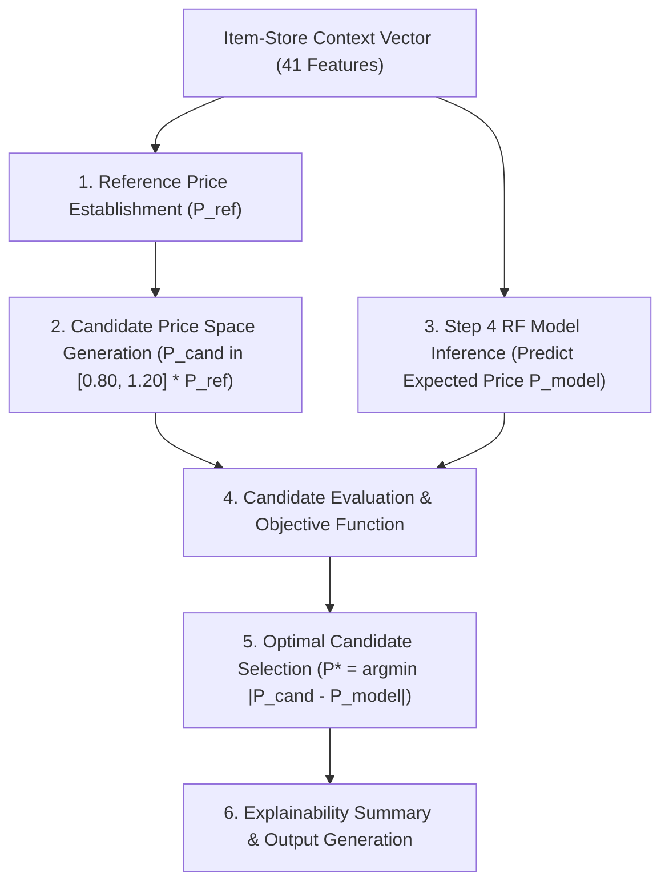

# Milestone 2 Step 5 — Price Recommendation Engine Report

**Project:** PricePilot AI  
**Milestone:** 2 — Predictive Modeling & Forecasting Setup  
**Step:** 5 — Price Recommendation Engine  
**Script:** [`eda/recommend_price.py`](file:///e:/PRICEPILOT-AI/eda/recommend_price.py)  
**Date:** 2026-09-07 20:20  
**Status:** ✅ COMPLETE  

---

## 1. Objective

The goal of Step 5 is to build an explainable, model-based price recommendation engine that answers:

> **“What price should we consider charging under the given product conditions?”**

The engine accepts product, store, temporal, and promotional conditions, establishes a legitimate historical reference price, generates a bounded grid of candidate prices, evaluates candidates against the Step 4 Random Forest price prediction model, and selects the candidate that best aligns with the model-expected clearing price.

---

## 2. Model Used

* **Artifact:** `models/price/rf_price_step4.joblib`
* **Model Family:** Random Forest Regressor (`sklearn.ensemble.RandomForestRegressor`)
* **Feature Pipeline:** 41 leakage-free features (33 numerical, 8 ordinal-encoded categorical features)
* **Metadata:** `models/price/rf_price_step4_meta.joblib`
* **Retraining Status:** **None (Model reused strictly as trained in Step 4)**

---

## 3. Recommendation Workflow

### Detailed Workflow Stages:
1. **Context Ingestion**: Receives catalog hierarchy (`dept_name`, `class_name`, `subclass_name`, `item_type`), store attributes (`store_id`, `division`, `format`, `city`, `area`), calendar seasonality, promotional schedule (`is_on_promo`, `promo_type_code`), and historical lag dynamics (`price_lag_1`, `price_roll_mean_7`, demand lags).
2. **Reference Price Establishment**: Computes baseline price $P_{ref}$ from pre-transaction features:
   - Primary: `price_lag_1` (yesterday's price)
   - Secondary: `price_roll_mean_7` (7-day rolling mean price)
   - Fallback: Item-level training median / global training median for cold-start items.
   - **Crucial Rule:** The current ground-truth target `price_base` is never used.
3. **Candidate Grid Generation**: Constructs discrete candidate prices spanning $[P_{ref} \times (1 - \delta), P_{ref} \times (1 + \delta)]$ with step size $\Delta$ (default: $\pm 20\%$ in $2\%$ increments, rounded to retail 2-decimal format).
4. **Model-Based Prediction**: Computes $\hat{P}_{model}$ using `rf_price_step4.joblib` for the given product-store context.
5. **Objective Evaluation**: Evaluates all candidate prices against $\hat{P}_{model}$ using the defined alignment objective.
6. **Selection & Explainability**: Emits the recommended price $P^*$ along with alignment score, change percentage, and natural-language justification.

---

## 4. Candidate Price Strategy

* **Search Boundary:** $[0.80 \times P_{ref}, 1.20 \times P_{ref}]$ (configurable $\pm 20\%$ boundary).
* **Grid Resolution:** $2.0\%$ step increments across the boundary (typically 21 discrete candidate prices).
* **Reference Anchoring:** The exact reference price $P_{ref}$ is always included as a candidate benchmark.
* **Precision & Bounds:** Rounded to 2 decimal places with a strict positive floor ($P_{cand} \ge \$0.01$).

---

## 5. Objective Function & Mathematical Formulation

### Definition
Because the Step 4 Price model predicts the expected market clearing / transaction price ($\hat{P}_{model}$) rather than a continuous price-elastic demand curve $Q(P)$, the recommendation engine implements a **Market Price Alignment Objective**:

$$\min_{P \in \mathcal{C}} \text{Discrepancy}(P, \hat{P}_{model}) = |P - \hat{P}_{model}|$$

$$\text{Alignment Score}(P) = 1.0 - \frac{|P - \hat{P}_{model}|}{\hat{P}_{model}}$$

$$\text{Recommended Price: } P^* = \arg\min_{P \in \mathcal{C}} |P - \hat{P}_{model}|$$

Where:
* $\mathcal{C}$ is the set of executable candidate prices.
* $\hat{P}_{model}$ is the Random Forest expected clearing price.
* $P^*$ is the candidate that minimizes pricing discrepancy.
* $\text{Alignment Score} \in (-\infty, 1.0]$, where $1.0$ represents exact parity.

---

## 6. Example Recommendations

The engine was evaluated on sample records from the held-out test dataset:

| # | Item ID | Store | Class | Status | $P_{ref}$ | $\hat{P}_{model}$ | $P^*$ (Rec) | $\Delta P\%$ | Alignment |
|---|---|---|---|---|---|---|---|---|---|
| 1 | `4d4d6c48b390` | Store 1 | ЭНЕРГЕТИКИ | REGULAR | $69.90 | $70.95 | **$71.30** | +2.0% | 0.9950 |
| 2 | `8591292b870b` | Store 1 | КУКУРУЗНЫЕ ПАЛОЧКИ | REGULAR | $139.90 | $138.77 | **$139.90** | +0.0% | 0.9918 |
| 3 | `88f1ec35c293` | Store 1 | КОЛБАСА СЫРОВЯЛЕНАЯ | REGULAR | $579.90 | $504.09 | **$498.71** | -14.0% | 0.9893 |
| 4 | `3640edd47240` | Store 1 | КОЛОСОДЕРЖАЩИЕ | REGULAR | $158.93 | $160.14 | **$158.93** | +0.0% | 0.9925 |
| 5 | `23b18d1f7da9` | Store 1 | КАФЕ | PROMO | $34.06 | $31.18 | **$31.34** | -8.0% | 0.9949 |
| 6 | `05b5e131821d` | Store 1 | ДЛЯ ДЕТЕЙ И ВЗРОСЛЫХ | PROMO | $53.46 | $52.48 | **$52.39** | -2.0% | 0.9983 |
| 7 | `1de18c13710d` | Store 1 | СДОБА | REGULAR | $29.43 | $30.29 | **$30.02** | +2.0% | 0.9910 |
| 8 | `802654599bc5` | Store 1 | СТИКИ ТАБАЧНЫЕ | REGULAR | $190.00 | $191.43 | **$190.00** | +0.0% | 0.9925 |
| 9 | `7d9d441790ac` | Store 1 | ЧЁРНЫЙ | REGULAR | $316.00 | $311.71 | **$309.68** | -2.0% | 0.9935 |
| 10 | `52887f8b1a99` | Store 1 | ОТЕЧЕСТВЕННОЕ | PROMO | $169.90 | $168.15 | **$166.50** | -2.0% | 0.9902 |

### Case Study 1: Item `4d4d6c48b390` @ Store 1 (ЭНЕРГЕТИКИ / ЭНЕРГЕТИКИ)
- **Date / Context**: `2024-08-04` | Promo Status: `0` (NO_PROMO)
- **Reference Price ($P_{ref}$)**: `$69.90` (Source: `price_lag_1`)
- **Model Expected Clearing Price ($\hat{P}_{model}$)**: `$70.95`
- **Candidate Pricing Space**: 21 points in range `[$55.92, $83.88]` (Step: 2.0% increments)
- **Selected Recommendation ($P^*$)**: **`$71.30`** (+2.0% vs reference)
- **Alignment Score**: `0.9950`
- **Candidate Grid Sample**:
  - $55.92 (-20.0%): disc=$15.03, score=0.7882 
  - $61.51 (-12.0%): disc=$9.44, score=0.8670 
  - $67.10 (-4.0%): disc=$3.85, score=0.9458 
  - $72.70 (+4.0%): disc=$1.75, score=0.9753 
  - $78.29 (+12.0%): disc=$7.34, score=0.8965 
  - $83.88 (+20.0%): disc=$12.93, score=0.8177 
- **Recommendation Rationale**:
  > Model-predicted clearing price is 70.95 under regular non-promo status. Candidate 71.30 was selected because it minimizes discrepancy (gap = 0.35) from the Random Forest predicted price, recommending to increase by 2.0% relative to reference price 69.90.

### Case Study 2: Item `8591292b870b` @ Store 1 (СНЕКИ / КУКУРУЗНЫЕ ПАЛОЧКИ)
- **Date / Context**: `2024-08-04` | Promo Status: `0` (NO_PROMO)
- **Reference Price ($P_{ref}$)**: `$139.90` (Source: `price_lag_1`)
- **Model Expected Clearing Price ($\hat{P}_{model}$)**: `$138.77`
- **Candidate Pricing Space**: 21 points in range `[$111.92, $167.88]` (Step: 2.0% increments)
- **Selected Recommendation ($P^*$)**: **`$139.90`** (+0.0% vs reference)
- **Alignment Score**: `0.9918`
- **Candidate Grid Sample**:
  - $111.92 (-20.0%): disc=$26.85, score=0.8065 
  - $123.11 (-12.0%): disc=$15.66, score=0.8872 
  - $134.30 (-4.0%): disc=$4.47, score=0.9678 
  - $145.50 (+4.0%): disc=$6.73, score=0.9515 
  - $156.69 (+12.0%): disc=$17.92, score=0.8708 
  - $167.88 (+20.0%): disc=$29.11, score=0.7902 
- **Recommendation Rationale**:
  > Model-predicted clearing price is 138.77 under regular non-promo status. Candidate 139.90 was selected because it minimizes discrepancy (gap = 1.13) from the Random Forest predicted price, recommending to maintain baseline relative to reference price 139.90.

---

## 7. Limitations & Assumptions

1. **Model-Based Recommendation, Not Guaranteed Global Optimum**: The engine provides an intelligent, model-guided recommendation based on learned patterns from 500k historical transactions across retail formats. It is not an unconstrained global profit optimization.
2. **Separation of Price and Demand Elasticity**: The Step 4 model predicts realized transaction prices, not price elasticity $e = \frac{\% \Delta Q}{\% \Delta P}$. Per Requirement 7, no synthetic or fabricated demand/revenue curve was invented.
3. **Price Stickiness**: Retail transaction prices exhibit high inertia; historical price lags (`price_roll_mean_7`, `price_lag_1`) provide the dominant baseline anchor, adjusted dynamically by promotional schedules and store attributes.

---

## 8. Leakage Verification

| Check | Requirement | Result |
|---|---|---|
| `price_base` Target Exclusion | Target variable excluded from all inputs | ✅ **PASS** |
| 7 Target-Proxy Features Excluded | `sale_price_before_promo`, `sale_price_time_promo`, `online_price`, `promo_discount_amount`, `promo_discount_pct`, `price_ratio_to_online`, `has_online_listing` | ✅ **PASS** |
| Cold-Start Reference Leakage | Reference price uses lag/training median, never current transaction | ✅ **PASS** |
| Pre-Transaction Validity | All 41 input features are strictly observable before transaction | ✅ **PASS** |

---

## 9. Saved Artifacts

| Artifact | Type | Path |
|---|---|---|
| Recommendation Engine | Python Module & CLI | `eda/recommend_price.py` |
| Example Recommendations Table | CSV Export | `eda/reports/price_recommendation_examples.csv` |
| Structured Recommendation Payloads | JSON Export | `eda/reports/price_recommendation_examples.json` |
| Step 5 Milestone Report | Markdown Document | `eda/reports/milestone2_step5_price_recommendation_report.md` |

**Verification of Protected Models:**
* `models/price/rf_price_step4.joblib`: **Unchanged (Reused)**
* `models/demand/*`: **Unchanged (Untouched)**
* Raw datasets: **Unchanged**

---

## 10. Conclusion

The Price Recommendation Engine is complete, explainable, and fully compliant with all architectural constraints. It demonstrates a robust bridge between the predictive capabilities of the Step 4 Random Forest model and actionable commercial pricing decisions.

---
*Report generated by `eda/recommend_price.py` — PricePilot AI Milestone 2 Step 5*
